# SQL-Driven Counterfeit Record Tracking System

This repository contains a functional prototype focused on the core counterfeit record tracking in a multi-branch institutional context, combining SQL Server stored procedures with a set of simple C# interfaces. The system simulates a realistic institutional workflow under a simplified architecture, demonstrating real-time data validation and transactional integrity.

## Key Highlights:

- Normalized database schema (conceptual, logical, physical)
- Transaction-safe CRUD (create/insert/update/delete) procedures with SERIALIZABLE isolation
- Real-time input validation and error handling at the SQL level
- Synchronization between database state and UI via trigger-based updates
- Fully working model for simulation and testing purposes
- Stack: MS SQL Server, T-SQL, C#, .NET Framework, WinForms

## Technical Highlights:

**✦ Error Handling & Validation**  
Implemented structured error handling and input validation within SQL procedures to ensure data consistency and prevent faulty inserts.

**✦ Referential Integrity & Normalization**  
Database schema designed with referential integrity constraints (PK–FK) and normalized structure to support clean data operations across linked tables.

**✦ Stored Procedure Abstraction**  
Encapsulated key operations (add, update, delete) in modular stored procedures for maintainability, reusability, and UI backend syncing.

**✦ Transaction Management**  
Critical updates wrapped in explicit transactions to prevent partial data saves and maintain system reliability during multi-step operations.

**✦ Live UI–DB Synchronization**  
Changes triggered via the C# interface are reflected instantly in the SQL Server backend, simulating a real-time data application.

## Screenshots – Prototype in Action

---

### 01. Initial Counterfeit Records in SQL Server  
- System-level query displays current counterfeit records stored in SQL Server. 
- Each row corresponds to a user-entered banknote report with unique ID, detection type, currency, denomination, and serial information.

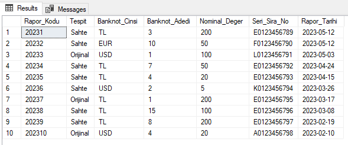

---

### 02. Viewer Panel – Real-Time Sync with SQL Server
- Displays counterfeit banknote records retrieved from SQL Server. 
- The “Refresh” button (labeled “Yenile” in the UI) triggers synchronization, ensuring the interface reflects the most recent database state. 
- Enables users to review, verify, and access record details instantly.

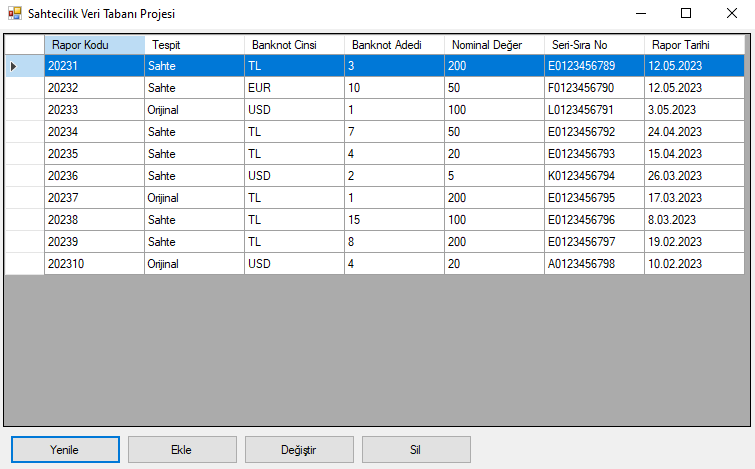

---

### 03. New Record Entry – Ready to Submit
- Upon clicking the “Add” button (labeled as “Ekle” in UI) in the viewer panel, this form allows users to create a new counterfeit banknote record. 
- All required fields—including report ID, denomination, serial number, and date—are properly filled. 
- The record will be submitted to SQL Server, triggered by clicking the “Save” button (“Kaydet” in UI).

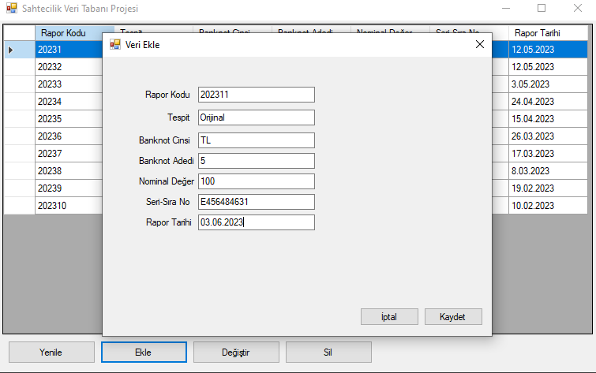

---

### 04. New Counterfeit Record Reflected in UI
- The newly added counterfeit record is now visible in the application interface. 
- This confirms that the form submission was successful and that the record passed validation before being stored in the database.
- Backend-level checks ensure only valid records appear in the interface after being safely committed.

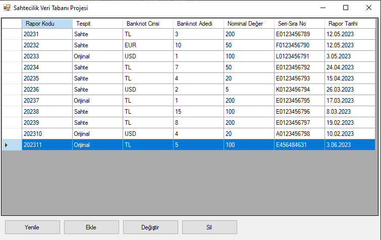

---

### 05. New Record Confirmed in SQL Server Output
- The new record is now visible in the SQL Server query output. 
- This confirms that the data entry form has successfully written the validated record into the backend database using a stored procedure.
- The procedure enforces data integrity through validation logic, error handling, and rollback control.

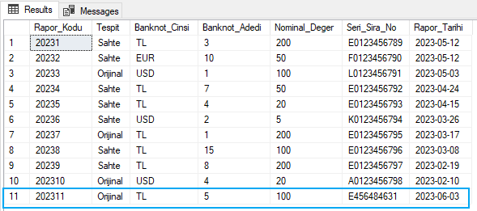

---

### 06. Update Panel – Record Editing Interface
- Users can open the update panel by double-clicking a record or selecting it and clicking the “Edit” button (“Değiştir” in UI). 
- The form auto-fills with the selected record’s data. 
- In this example, report code 202310 is being updated to 202317. After changes, clicking the “Update” button (“Güncelle” in UI) triggers a stored procedure with backend validation and error handling.

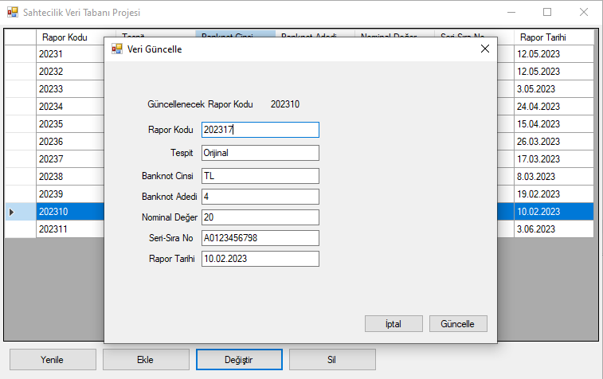

---

  
Click to expand UI Screenshots

  
### 07. Updated Record Reflected in Interface
- After editing, the updated record (report code changed from 202310 to 202317) is now visible in the application interface. 
- This confirms that the update request was successfully processed and that the viewer panel reflects the latest data state.

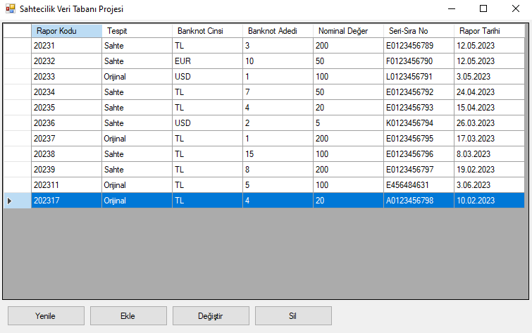

---

### 08. Updated Record Confirmed in SQL Server
- The same record with updated report code (202317) is now visible in the SQL Server query output. 
- This confirms that the change was executed at the database level through a stored procedure, preserving consistency and integrity.

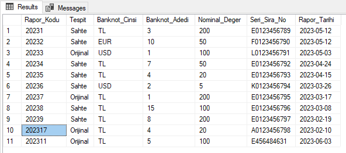

---

### 09. Delete Request Triggered from Viewer Panel
- To delete a record, the user selects it in the viewer panel and clicks the “Delete” button (labeled as “Sil” in UI). 
- The system prompts a confirmation dialog before proceeding. 
- In this example, the user is attempting to delete the record with report code 20232.

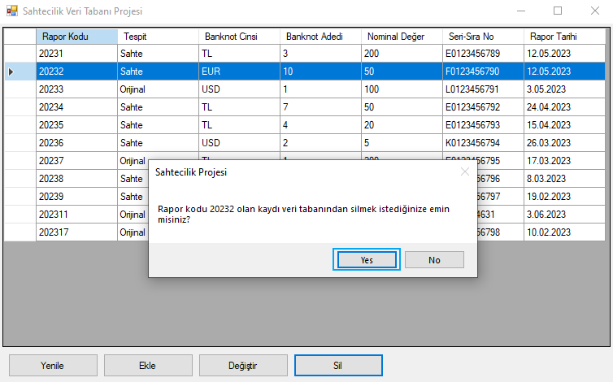

---

### 10. Delete Operation Confirmed in UI
- After the user confirmed the deletion, the record with report code 20232 was successfully removed from the interface.
- A confirmation message is displayed, indicating the operation was completed via a backend-stored procedure with validation.

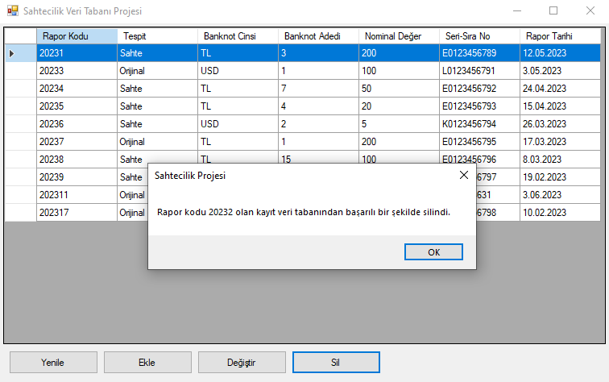

---

### 11. Deleted Record No Longer in SQL Server Output
- The same record (report code 20232) no longer appears in the SQL Server query result. 
- This confirms that the deletion was successfully executed at the database level, maintaining consistency across layers. 

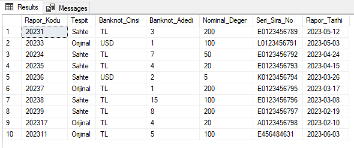

---

### 12. Validation Alert – Required Field Missing
- When a required field (e.g., Nominal Value) is left empty, the system blocks submission and alerts the user.
- This check is enforced both at the UI level and within the SQL stored procedure, ensuring robust validation.

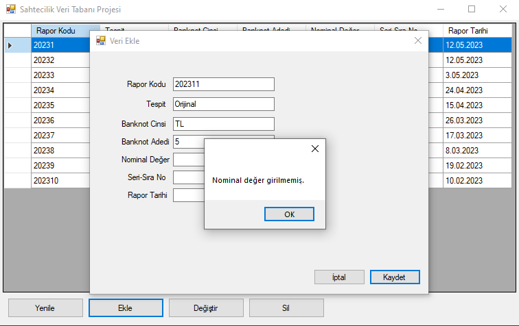

---

### 13. Duplicate Entry Prevented – Add Operation
- If a user attempts to create a record with an already existing report code, the system prevents duplication.
- The control is executed via a backend procedure that checks primary key constraints and maintains uniqueness.

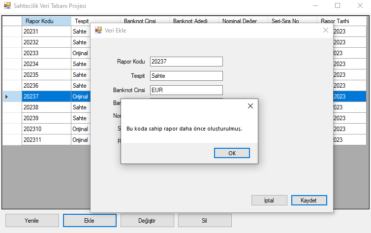

---

### 14. Duplicate Entry Prevented – Update Operation
- When updating a record, if the new report code already exists in the system, the update is rejected.
- This preserves key integrity and avoids accidental overwrites, enforced by SQL-level validation.

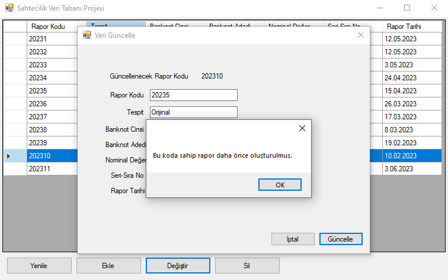

---

### 15. Conceptual Data Model – Entity-Relationship Design
- The ER diagram illustrates the conceptual design of the counterfeit tracking system. 
- It maps key entities such as Bank, Personnel, Institution, and Report Types (Judicial/Police), and shows their relationships. 
- This structure is based on a partial yet realistic representation of institutional workflows, and is designed to be extendable for advanced reporting needs.

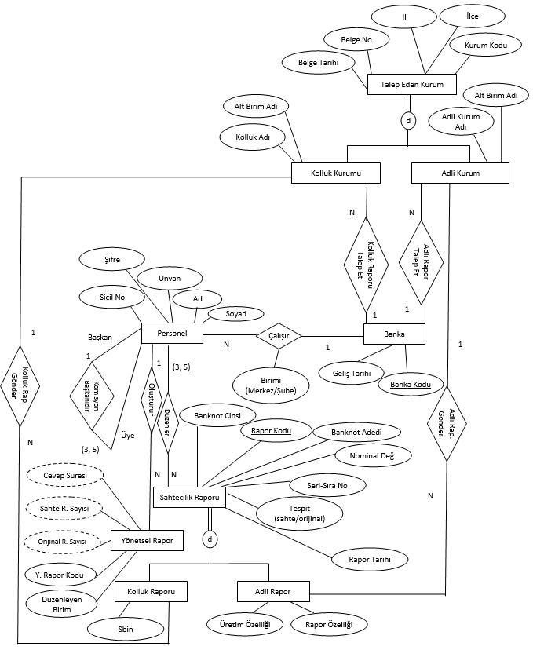

---

### 16. Relational Schema – Logical Data Structure
- This relational schema represents the logical data structure derived from the conceptual model. 
- It defines tables, keys, and foreign key relationships among institutions, banknote counterfeit records, personnel, and administrative entities. 
- Designed for scalability and normalization, the model forms the technical backbone of the system.

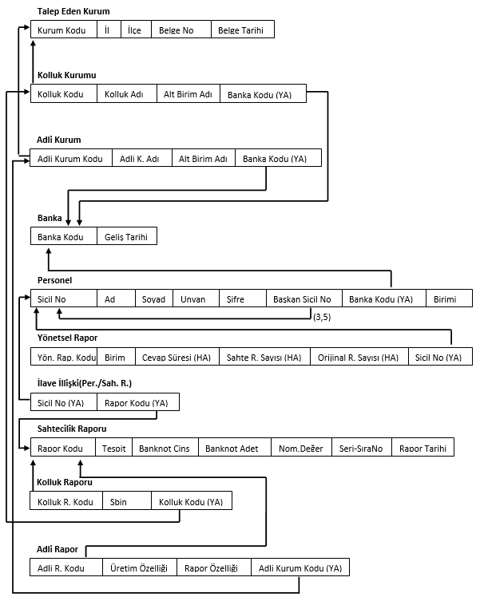

---

## Tools Used in Implementation:

- T-SQL
- C#
- Microsoft SQL Server Management Studio 19.0.2
- Microsoft Visual Studio Community 2022 (64-bit), Version 17.6.2
- Microsoft Net Framework Version 4.8.04084

Note: The C# code provided here is minimal and serves only to simulate data flow between the UI and the SQL backend. The focus of this project is on the SQL architecture, data integrity, and stored procedure logic.

