# SQL-Driven Counterfeit Record Tracking System

This repository contains a functional prototype focused on the core counterfeit record tracking in a multi-branch institutional context, combining SQL Server stored procedures with a set of simple C# interfaces. The system simulates a realistic institutional workflow under a simplified architecture, demonstrating real-time data validation, transactional integrity, and database synchronization through UI-triggered operations.

## Key Highlights:

- Fully normalized schema (conceptual, logical, physical)
- Stored procedures for CRUD (create/insert/update/delete) operations with rollback protection
- Serialization-level transactions ensuring consistency
- Fully working model for simulation and testing purposes

## Technical Highlights:

**✦ Error Handling & Validation**  
Implemented structured error handling and input validation within SQL procedures to ensure data consistency and prevent faulty inserts.

**✦ Referential Integrity & Normalization**  
Database schema designed with referential integrity constraints (PK–FK) and normalized structure to support clean data operations across linked tables.

**✦ Stored Procedure Abstraction**  
Encapsulated key operations (add, update, delete) in modular stored procedures for maintainability, reusability, and UI backend syncing.

**✦ Transaction Management**  
Critical updates wrapped in explicit transactions to prevent partial data saves and maintain system reliability during multi-step operations.

**✦ Live UI–DB Synchronization**  
Changes triggered via the C# interface are reflected instantly in the SQL Server backend, simulating a real-time data application.

## Screenshots – Prototype in Action

---

### 01. Initial Counterfeit Records in SQL Server  
- System-level query displays current counterfeit records stored in SQL Server. 
- Each row corresponds to a user-entered banknote report with unique ID, detection type, currency, denomination, and serial information.

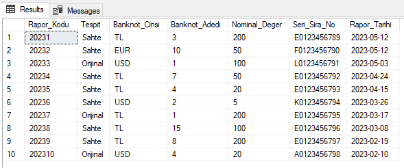

---

### 02. Viewer Panel – Real-Time Sync with SQL Server
- Displays counterfeit banknote records retrieved from SQL Server. 
- The “Refresh” button (labeled “Yenile” in the UI) triggers synchronization, ensuring the interface reflects the most recent database state. 
- Enables users to review, verify, and access record details instantly.

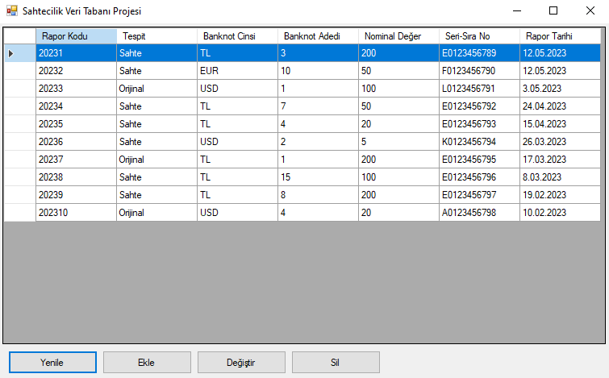

---

### 03. New Record Entry – Ready to Submit
- Upon clicking the “Add” button (labeled as “Ekle” in UI) in the viewer panel, this form allows users to create a new counterfeit banknote record. 
- All required fields—including report ID, denomination, serial number, and date—are properly filled. 
- The record will be submitted to SQL Server, triggered by clicking the “Save” button (“Kaydet” in UI).

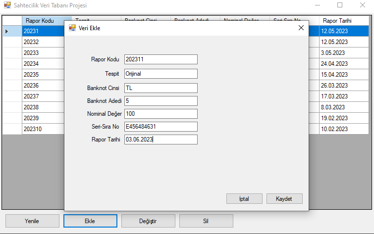

---

### 04 New Record Reflected in UI
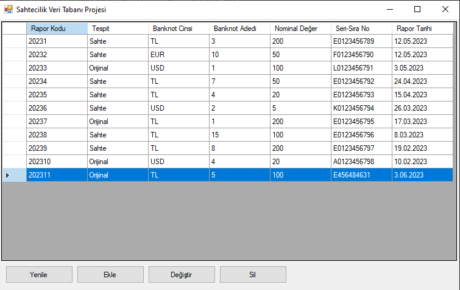

---

### 05 New Record Confirmed in SQL Server
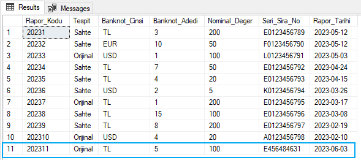

---

### 06 Update Panel
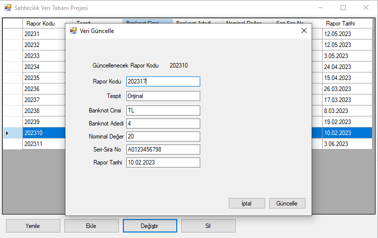

---

### 07 Updated Record Reflected in UI 
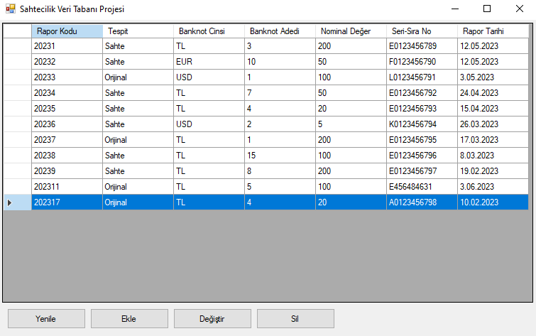

---

### 08 Updated Record Confirmed in SQL Server  
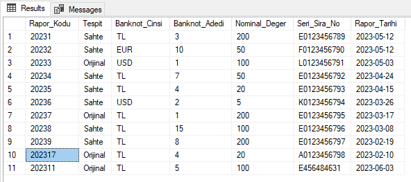

---

### 09 Delete Request
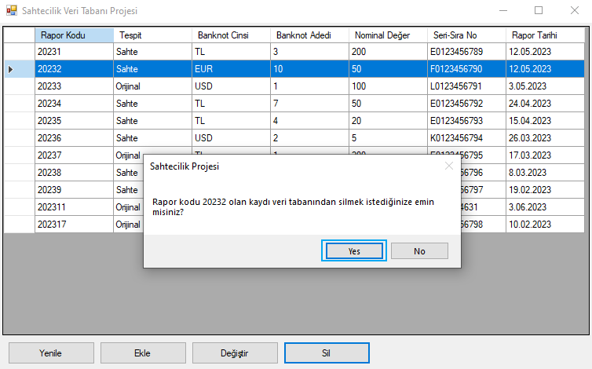

---

### 10 Delete Operation Confirmed in UI
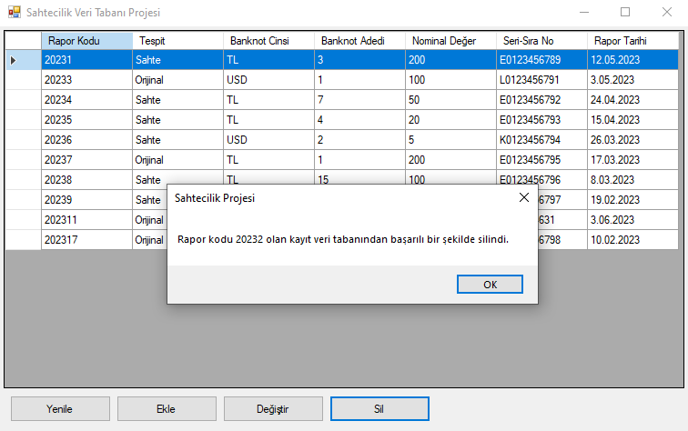

---

### 11 Deleted Record Reflected in SQL Server 
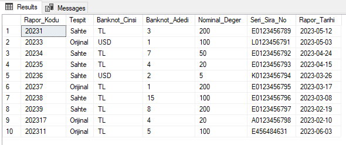

---

### 12 Validation Alert
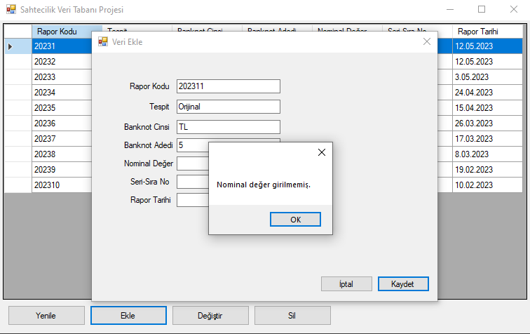

---

### 13 Duplicate Entry Prevented – Add Operation
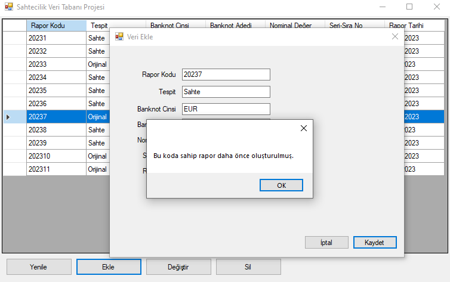

---

### 14 Duplicate Entry Prevented – Update Operation 
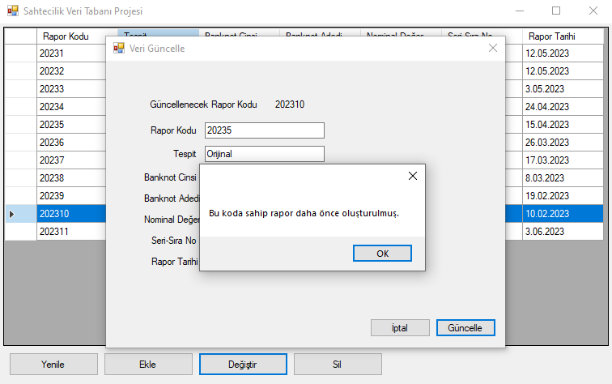

---

### 15 Conceptual Data Model
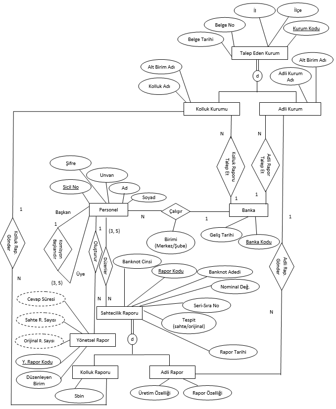

---

### 16 Logical Data Model
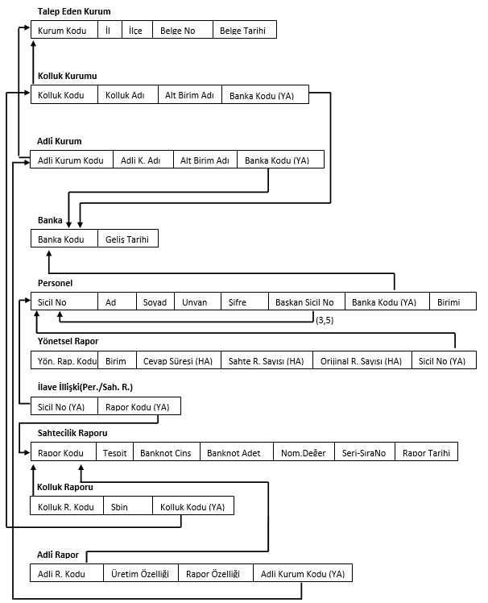

---

## Tools Used in Implementation:

- T-SQL
- SQL
- C#
- Microsoft SQL Server Management Studio 19.0.2
- Microsoft Visual Studio Community 2022 (64-bit), Version 17.6.2
- Microsoft Net Framework Version 4.8.04084

Note: The C# code provided here is minimal and serves only to simulate data flow between the UI and the SQL backend. The focus of this project is on the SQL architecture, data integrity, and stored procedure logic.

